# 金融市场期末复习

> 本复习针对于 互联网+ 专业 第二学位，主要是对于复习ppt中提到的知识点进行整理和汇总，方便自己学习以及学弟学妹参考借鉴，时间仓促多用截图请谅解。
>
> **授课教师：郭斌**

---

# 考试题型介绍

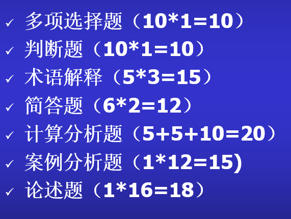

---

# 目录

[TOC]

---

# 导论

## 金融内涵的演进和发展

### 理论发展

**货币理论**（18世纪以前）：货币的起源、职能、价值与货币流通需要量。

**信用理论和银行理论**（19世纪到20世纪20年代）：银行为主体，银行的性质与作用。

**货币政策理论与金融市场理论**（20世纪30年代到80年代）：货币政策的作用与运作；现代金融理论的兴起。

**宏观金融理论与微观金融理论**（20世纪80年代至今）：金融国际化、电子化、网络化背景下的金融理论的拓展与深化。

### 内涵演进

### 现代金融的理解：一个框架广义的东西

## 金融体系概述

为金融活动的组织体系，包括金融中介机构和金融市场，又称金融系统。

### 金融体系的构成

### 参与者

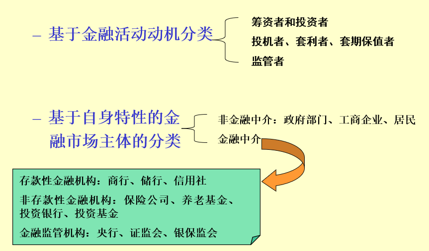

### 金融系统的功能

**<u>资源配置</u>**是金融系统最基本的功能

**<u>管理风险</u>**：风险的再分配，通过保险担保及衍生的金融工具来分散或者转移风险

**<u>支付结算</u>**：提供清算和支付的途径，以完成商品、劳务和资产的交易——有效率的支付系统是金融体系成熟完善的重要标志

**<u>集聚分割</u>**：积少成多，便利金融资源的流动和交易。

## 金融资产（==非重点==：不排除考的可能性）

金融资产：指一切代表未来现金流要求权的凭证，亦称为金融工具、产品或证券。金融资产可以划分为基础性金融资产与衍生性金融资产两大类。前者主要包括债务性资产和权益性资产；后者主要包括远期、期货、期权和互换等。

# 利率

## 理解利率

## 到期收益率

**到期收益率：**最精确的计量利率的指标

**到期收益率**（Yield to Maturity）： 指来自于某种金融工具的现金流的现值总和与其今天的价值相等时的利率水平，相当于投资人按照当前市场价格购买债券并且一直持有到期满时可以获得的年平均收益率。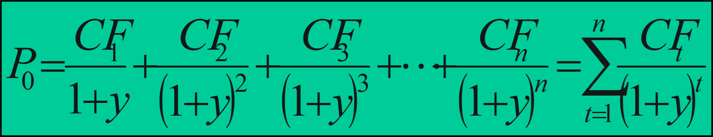

> 其中，P0表示金融工具的当前市价，CFt表示在第t期的现金流，n表示时期数，y表示到期收益率。

### 相关计算

> #### 普通贷款的到期收益率
>
> 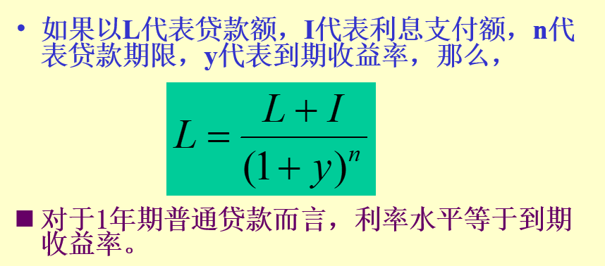
>
> #### 固定支付贷款的计算
>
> 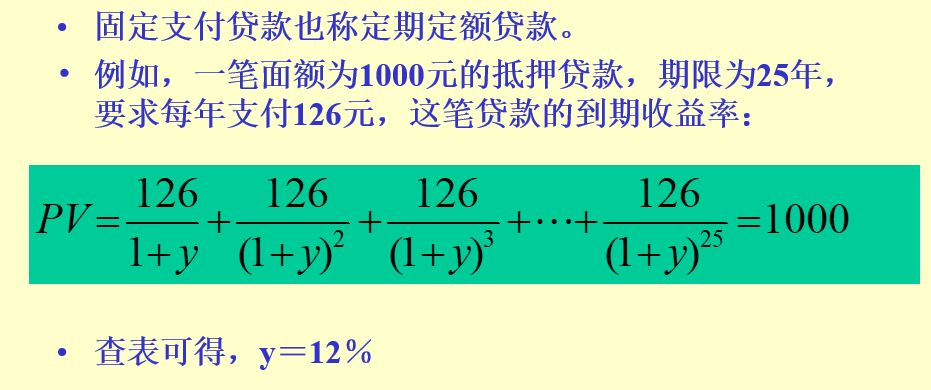
>
> #### 债券
>
> 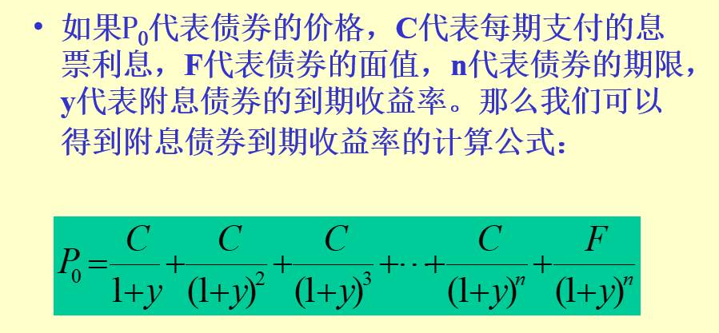
>
> 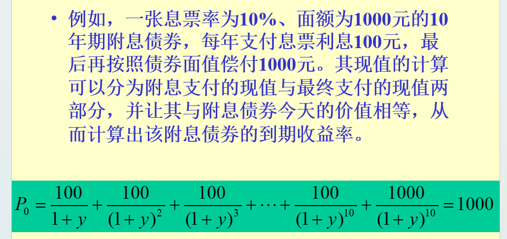
>
> #### 零息债券
>
> 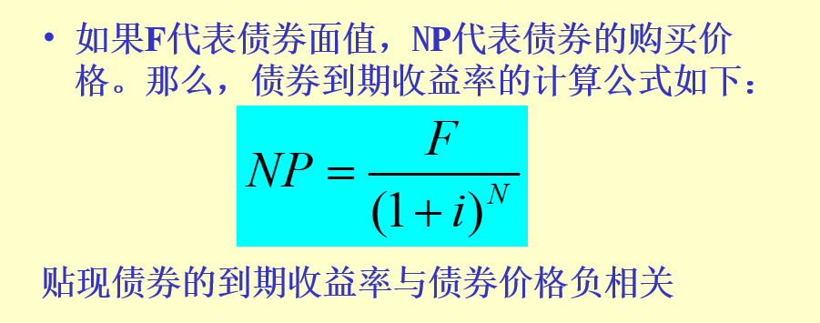
>
> 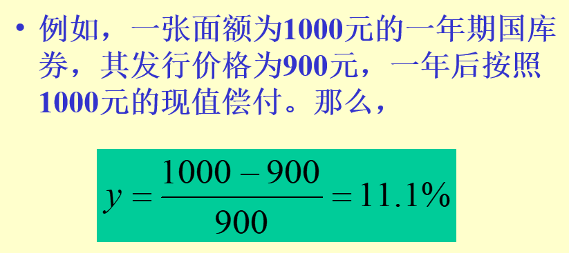
>
> 

### 优缺点

### 年回报率

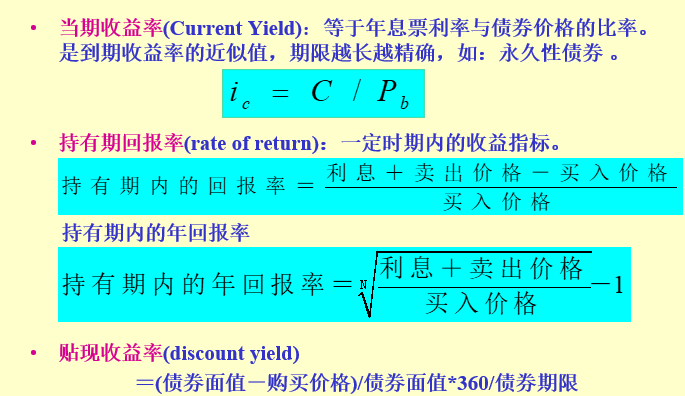

### 名义利率和实际利率

**名义利率**（nominal interest rate）：不考虑通货膨胀风险的利率。

**实际利率**（real interest rate） ：从名义利率剔除通货膨胀因素的利率。

**费雪方程式**:反映名义利率(i)、实际利率(r)与通货膨胀(I)之间的关系。

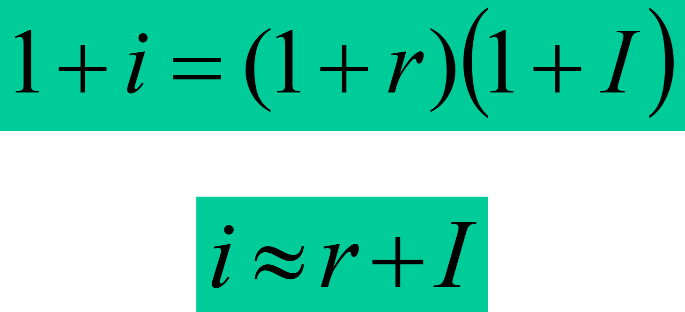

## 利率决定理论

### 古典利率理论

•**主要代表人物：**庞巴唯克、马歇尔、魏克塞尔和费雪。

•**主要论点：** 利率是由实际领域的投资和储蓄这两个因素决定的，投资代表资金的需求，储蓄代表资金的供给，供给能自创需求，所以决定利率的关键在储蓄。而储蓄取决于“时间偏好” **、** “节欲”、“等待”等因素。

•资本的供给来源于储蓄，储蓄是利率的增函数。S=S(r) ds/dr>0

•资本的需求取决于资本边际生产力与利率的比较。投资是利率的减函数。I=I(r)  dI /dr<0

​                   												 **I (r)=S(r)**

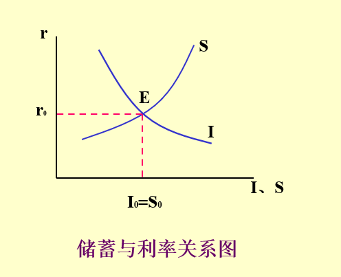

#### 特点

•**I 和S都由是i的函数，与Ｙ无关．利率调节储蓄和投资使之趋于均衡。投资曲线的移动取决于投资的边际收益率；储蓄曲线的移动取决于边际储蓄倾向大变化**

•**注重实物因素的影响（实际利率理论），非货币性的利率理论。**

### 凯恩斯的流动性偏好理论

- **凯恩斯**认为古典学派的理论前提即市场经济会自动达到充分就业均衡是不现实的。认为利率由**货币的供求**关系决定，而不是由投资和储蓄的关系决定 。**货币需求量又取决于人们的流动性偏好：流动性的偏好强，愿意持有货币，当货币需求大于货币供给，利率上升；反之，利率下降。**

- **货币总需求=交易和预防货币需求+投机性货币需求**
  $$
  L=L_1 + L_2 =L_1(Y)+L_2(r)
  $$

  | 影响因素 | 因素改变 | 货币需求量（供给量）变化 | 利率变化 |
  | -------- | -------- | ------------------------ | -------- |
  | 收入     | ↑        | md↑                      | ↑        |
  | 物价水平 | ↑        | md↑                      | ↑        |
  | 货币供给 | ↑        | ms↑                      | ↓        |

  #### 特点

  •**货币的利率决定理论。**

  •**货币通过利率影响投资、消费和收入。**

  •适用于经济的短期分析。

### 可贷资金利率理论

•**新古典主义的利率理论，也被称为借贷资金学说，综合了古典利率理论和凯恩斯的流动性偏好利率理论，将货币因素与实际因素综合为一种新的分析框架。**

•**主要代表人物：罗伯特、俄林和米尔达尔，勒纳。**

•**认为利率是由可贷资金的供求关系决定的。可贷资金的来源有实物储蓄和货币供给量的变动；可贷资金需求包括投资和货币需求量的变动 。** 

•**利率决定于可贷资金的供应和需求的均衡点。**

### IS-LM分析的利率理论

•IS-LM模型由希克斯首先提出，由汉森**加以发展而成。由于这个模型既考虑了储蓄投资，又考虑了货币供求，还考虑了收入的作用，所以它是一个一般均衡模型，在这个模型中决定的利率是均衡利率。**

• **IS-LM模型的理论基础是凯恩斯理论。**

## 利率风险结构

•**利率风险结构（Risk structure of interest rates） ：是指相同期限债券的不同利率之间的关系，反映债券承担风险的大小对其收益率的影响。**

- 违约风险

  风险债券利率与无风险债券利率之差成为风险升水**(Risk Premium)**

- 流动性

  **流动性高风险小，流动性差的债券的持有人要求有正的风险升水。** 

- 税收

  **价格和利率相同的债券，所得税高者需求小。**

•**利率期限结构（Term structure of interest rate** **）：同类证券（风险、流动性及税收待遇相同）不同期限与其利率之间的关系。**

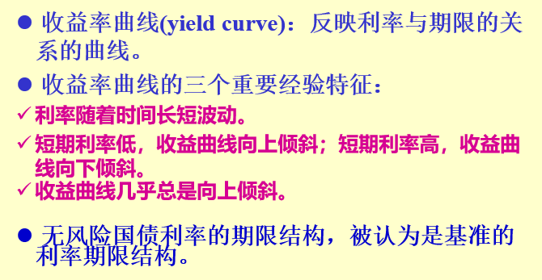

### 预期理论

当期短期利率和预期未来短期利率的关系

**长期利率等于**当期短期利率**与**预期的未来短期利率**之和的平均数。**

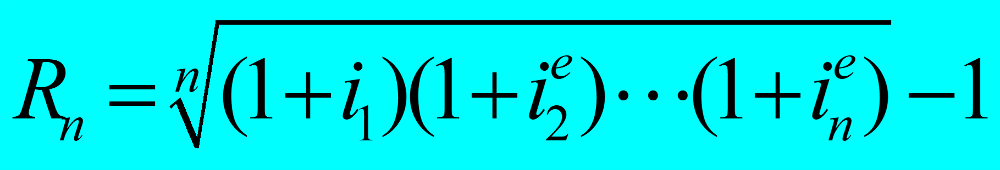

### 市场分割

**该理论认为，各种期限的证券市场是彼此分割、相互独立的。利率是由各个市场的投融资者的偏好决定的。** 

### 流动性升水

**流动性升水理论 ：长期证券比短期证券有更多的风险，其流动性较差，必须给予流动性报酬作为补偿，从而使长期证券的利率大于短期证券的利率。**

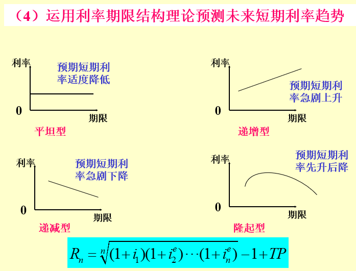

## 利率市场化

•**政府或货币管理当局放松或放弃对利率的直接控制或限制，让金融机构根据资金的市场供求状况自行决定利率水平，政府或货币管理当局只对利率实行间接的宏观调控。**

### 中央银行的特殊性

**利率市场化不等于利率完全由市场决定，而中央银行可以撒手不管。利率市场化有以下两个含义：**

 **第一，中央银行决定基准利率；**

 **第二，中央银行决定基准利率的方式是通过运用货币政策工具，即通过市场手段来实现的，而不是通过行政手段来实现的。** 

### 主要理论

- 金融抑制论
- 金融深化论
- 金融约束论

# 中央银行与货币政策

## 中央银行

•**是一个国家或地区负责发行货币、管理货币流通、制定货币政策和提供清算体系的管理当局。**

•**中央银行建立的必要性主要有：**

•**⑴**银行券（**bank note**）统一发行

•**⑵**建立全国统一的清算机构

•**⑶**为商业银行提供最后流动性支持

•**⑷**对金融业进行管理、监督与协调

### 主要职能

### 独立性

> **独立性问题源于中央银行与政府的目标往往不一致。因此独立性问题的表现集中体现在中央银行与政府的关系上。**

**中央银行独立性的必要性**

中央银行的工作始终是追求货币政策的基本原则和目标。经济工作虽然是政府的中心工作，但社会问题往往也是政府关注的重点。而当政治矛盾突出时，政治要求则压倒一切。缺乏独立性，中央银行的目标就会被淹没。

中央银行工作需要具备必要的专业理论素养和较为长期的专业经验积累。仅凭政治经济的普遍原理和普遍经验指挥，往往是不准确的。

**中央银行独立性是相对的**

中央银行是整个宏观调控体系中的一个组成部门，而不是孤立的，更不是惟一的；中央银行的活动总是在国家授权下进行。

**中央银行独立性的强弱**

各国的国情与历史传统不同，中央银行独立性的强弱也不同。 

## 货币

### 货币层次

**中央银行一般根据宏观监测和宏观调控的需要，根据**流动性**的大小将货币供应量划分为不同的层次并分别予以计量，以有效的控制货币供给。**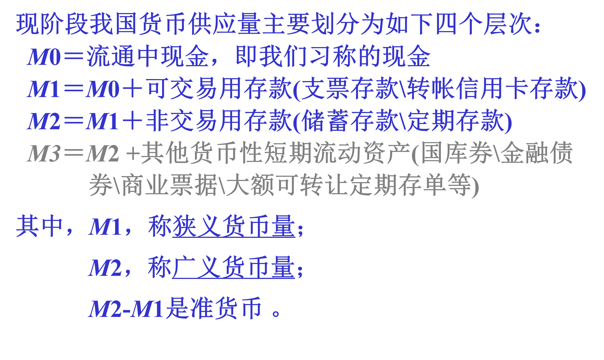

### 货币供给

•**货币供给**是指某时点上的货币存量。**货币供给理论**主要研究货币供给的决定机制。

#### 存款乘数

$$
M=m·B
$$

m为存款乘数：m=1/rr B（增加存款）

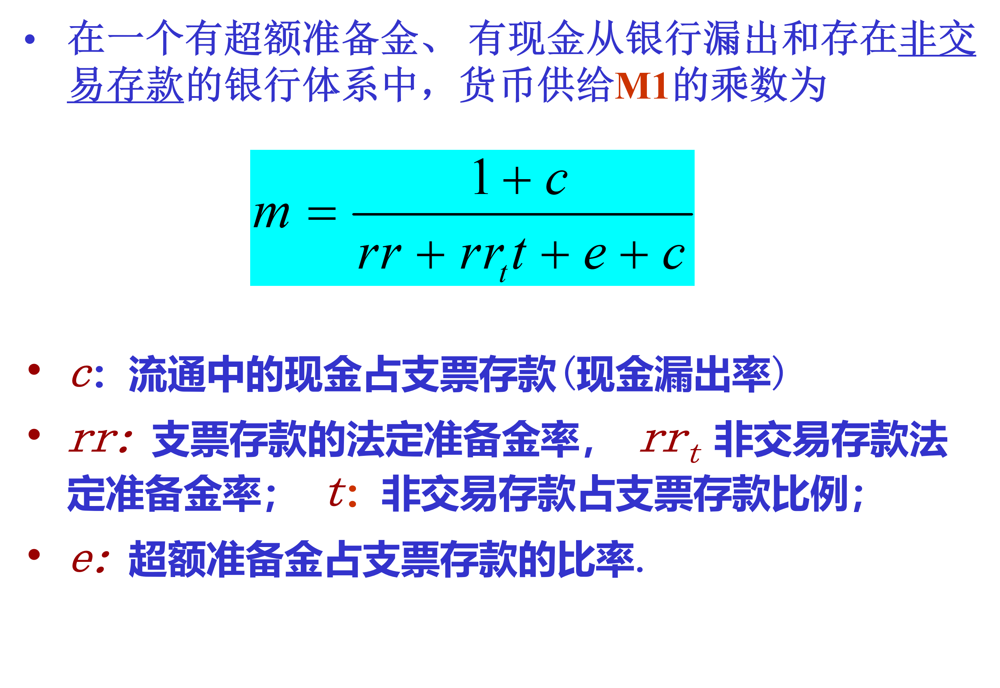
$$
B=R（银行准备金）+C（流通现金）
$$

### 货币政策工具

> **银行准备金**是指银行以 库存现金 的形式，或在 中央银行 中以无息存款的形式而保留的一部分存款
>
>  **法定存款准备金**（Legal Deposit Reserve）存款准备金分为法定存款准备金和超额存款准备金。法定存款准备金是指法律规定金融机构必须存在中央银行里的。
>
>  **超额准备金，**是指商业银行及存款性金融机构在中央银行存款账户上的实际准备金超过法定准备金的部分。
>
> **窗口指导**：是指央银行通过劝告和建议来影响商业银行 信贷行为，属于温和的、非强制性的货币政策工具。
>
> **货币政策**指中央银行为实现特定的经济目标而采用的各种控制和调节货币、信用以及利率等变量的方针和措施的总称。
>
> **信用拆借交易**，是指与全国银行间同业拆借中心联网的金融机构之间通过同业中心的交易系统进行的无担保资金融通行为。

#### 法定准备金率

**保证银行的流动性和现金兑付能力；控制货币供应量；有助于中央银行进行结构调整。**

•**有较强的告示效应；**

•**有强制性的影响；**

•**缺乏应有的灵活性，影响存款机构正常的财务计划；**

**存款准备金政策是一种威力强大、但不宜常用的货币政策工具**

#### **再贴现政策（利率政策）**

#### 公开市场业务

### 货币传导机制

**货币政策的作用过程和传导途径。**

•**主要传导机制：**

​	**利率传导渠道**

​	**信用传导渠道**

​	**金融资产价格传导渠道**

​	**汇率传导渠道**

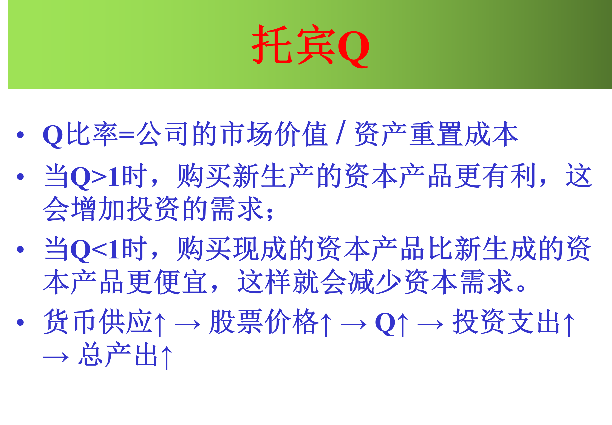

# 货币市场

> **同业拆借市场产生于存款准备金政策的实施，伴随着中央银行业务和商业银行业务的发展而发展。**
>
> •**经购货人承兑的汇票称**商业承兑汇票**，经银行承兑的汇票即为**银行承兑汇票**。**  
>
> •**回购市场是指通过回购协议进行短期资金融通交易的市场。**
>
> •**所谓回购协议（**Repurchase Agreement**），指的是在出售证券的同时，和证券的购买商签定协议，约定在一定期限后按原定价格或约定价格购回所卖证券，从而获取即时可用资金的一种交易行为。**从本质上说，回购协议是一种抵押贷款，其抵押品为证券**。**

### 回购

**商业银行、投资银行是典型的卖方（融资方）。**

**货币市场基金、企业和政府是典型的买方（投资方）。**

**央行则通过回购交易影响货币供给和短期利率。**

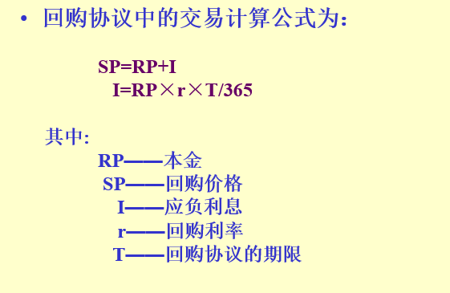

> 例题
>
> 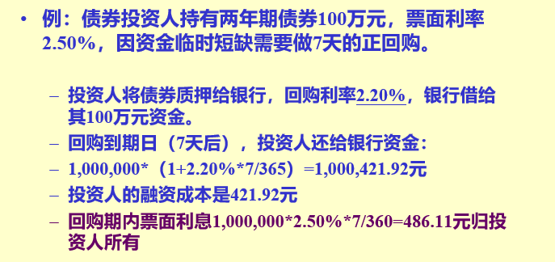

•**质押式回购**是指持券方有资金需求时将手中的债券出质给资金融出方的一种资金交易行为。

•**买断式回购**是指债券持有人（正回购方）将债券卖给债券购买方（逆回购方）的同时，交易双方约定在未来某一日期，正回购方再以约定价格从逆回购方买回相等数量同种债券的交易行为。

> •**主要区别在于标的券种的**所有权归属不同**。**
>
> •**在质押式回购中，融券方**(**逆回购方**)**不拥有标的券种的所有权，在回购期内，融券方无权对标的债券进行处置；**
>
> •**在买断式回购中，标的债券的所有权发生了转移，融券方在回购期内拥有标的券种的所有权，可以对标的债券进行处置，只要到期时有足够的同种债券返售给正回购方即可。**

# 股票市场

## 股票

### 特征

### 种类

•**按剩余索取权和剩余控制权不同：**普通股、 优先股。

•**按是否记名分为：记名股票、无记名股票。**

•**按有无面值：有面值股票、无面值股票。**

•**与普通股相比，优先股的特点：**

**（**1**）股息分配和公司剩余财产分配中拥有优先权。**

**（**2**）一般股息率固定，不随公司利润水平的变化而变动。**

**（**3**）表决权有限和不享有优先认股权。**

**（**4**）价格比较稳定。**

> •**存托凭证**（**Depository Receipts**，简称**DR**），是指在一国证券市场流通的代表外国公司有价证券的可转让凭证，由存托人签发，以境外证券为基础在境内发行，代表境外基础证券权益的证券。

## 股票市场

#### 股票发行监管制度

•**审批制**是完全计划发行的模式。**是采取严格的**额度计划管理、指标控制和实质审查**

•**核准制**则是从审批制向注册制过度的中间形式。**实质审查**

•**注册制**则是目前成熟市场普遍采用的发行制度。形式审查

尽调就是*尽职调查*的意思，简单点理解就是由中介机构在企业的配合下，对企业的历史数据和文档、管理人员的背景、市场风险、管理风险、技术风险和资金风险做全面深入的审核，多发生在企业公开发行股票上市和企业收购以及基金管理中。

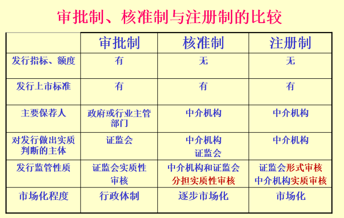

#### 股票定价

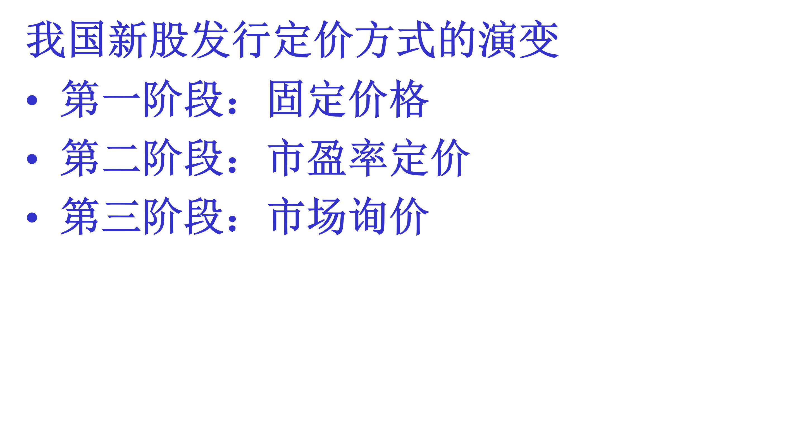

#### 股票价格指数

•**是运用统计学中的指数方法编制而成的反映股市总体 价格或某类股价变动和走势的指标。**

- –**1.股票价格指数是一个平均指数，它可以大致反映出一个国家经济运行的状况。**
- –**2.股票价格指数也是买卖股票的一个重要参考。**
- –**3.股票价格指数是用多种股票平均价格水平及其变动来衡量股市行情的指标。**
- –**4.股票价格指数的高低也标志着投资风险的大小。**

##### 简单算术股价指数

**（**1**）相对法。又称平均法，就是先计算各样本股价指数，再加总求总的算术平均数。其计算公式为：**

**其中，P0 表示第**i**种股票的基期价格， P1表示第**i**种股票的报告期价格，**n**为样本数。** 

**（**2**）综合法。综合法是先将样本股票的基期和报告期价格分别加总，然后相比求出股价指数，即：**

##### 加权股价平均指数

•**加权股价指数是根据各期样本股票的相对重要性予以加权，其**权重可以是成交股数、总股本等**。**

•**按时间划分，权数可以是基期权数，也可以是报告期权数。**

•**以**基期**成交股数（或总股本）为权数的指数称为**拉斯拜尔指数**，其计算公式为：**

•**以**报告期**成交股数（或总股本）为权数的指数称为**派氏指数**。其计算公式为：** 

### 股息贴现

•**现金流贴现法**运用于普通股价值分析中的模型，又称**股息贴现模型**。其函数表达式如下：

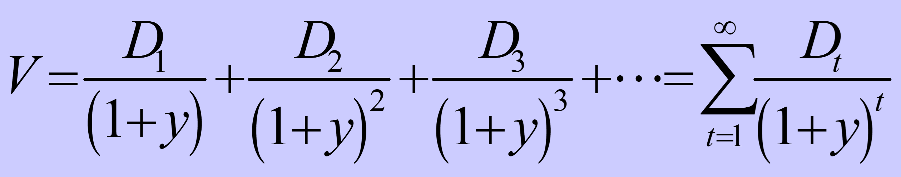

•**其中，**V**代表普通股的内在价值，**Dt**是普通股第**t**期支付的股息和红利，**y**是贴现率，又称资本化率（**the capitalization rate**）。

#### 模型分类

**根据对股息增长率的不同假定，股息贴现模型可以分成零增长模型、不变增长模型、多元增长模型等形式**

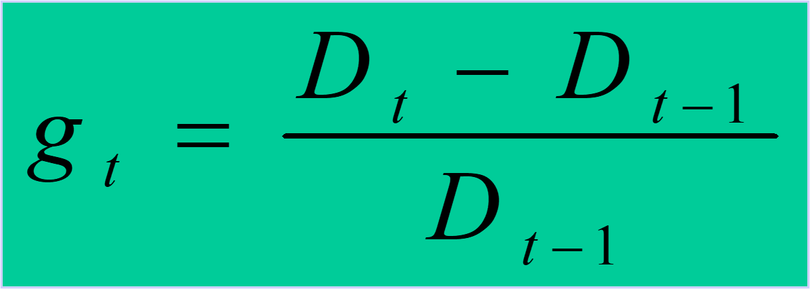

##### 零增长

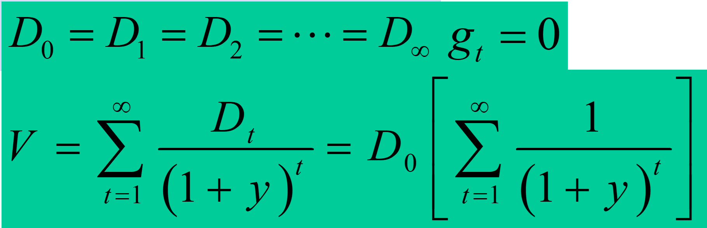

> 例题：
>
> 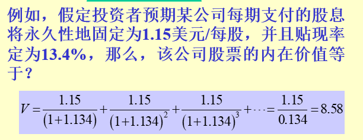

##### 不变增长

•**不变增长模型**(Constant-Growth Model)**是股息贴现模型的第二种特殊形式。不变增长模型又称**戈登模型**(Gordon Model)**。

•**戈登模型有三个假定条件：**

**1**．股息的支付在时间上是永久性的， **t** **趋向于无穷大** **;**

**2**．股息的增长速度是一个常数，即**g_t= g;**

**3**．模型中的贴现率大于股息增长率，即 **y**>**g**。

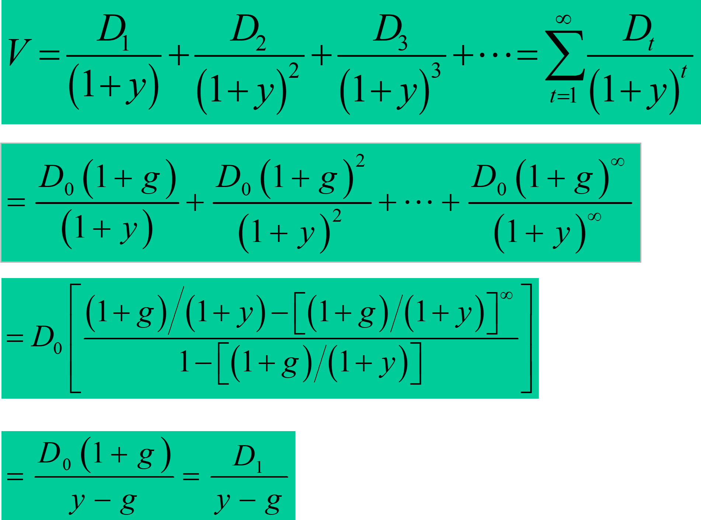

> 例题：
>
> 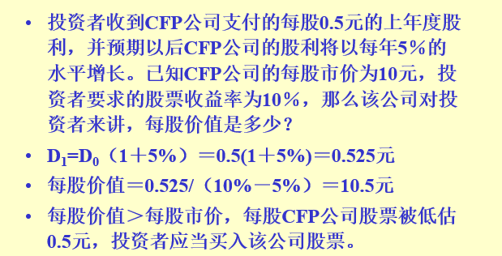

##### 多元增长（ppt中没有提到）

## 股权分置

> •**所谓股权分置，是指上市公司的一部分股份上市流通，另一部分暂不上市流通。**•**上市公司的股权分置是我国经济体制改革不配套和股票市场制度设计不合理所留下的制度性缺陷。**
>
> •**股权分置直接导致上市公司的股权结构极不合理，使公司治理缺乏共同的利益基础，造成了**同股不同权**、**同股不同利**和**同股不同价**的怪异现象**.

### 改革的必要性

1. •**扭曲证券市场定价机制**

   三分之二股份不能上市流通，客观上导致单一上市公司流通股本规模相对较小，股市投机性强，股价波动较大和定价机制扭曲。 

2. •**导致公司治理缺乏共同利益基础**

   非流通股股东的利益关注点在于资产净值的增减，流通股股东的利益关注点在于二级市场的股价波动，客观上形成了非流通股东和流通股东的“利益分置”

3. •**不利于上市公司的购并重组**

   以国有股份为主的非流通股转让市场是一个参与者有限的协议定价市场，交易机制不透明，价格发现不充分，严重影响了国有资产的顺畅流转和估值水平，也是内幕交易猖獗,关联交易盛行的根本原因。

==目标==： **真正实现同股同权** 

# 商业银行

> ​    **资本充足率问题：**资本金比例不能太低，否则会增加银行财务风险甚至破产的可能。

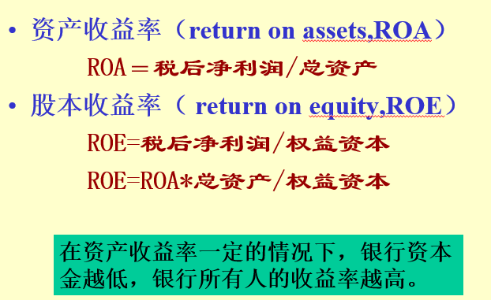

### 流动性管理

#### 资本金管理

•**商业银行资本金管理：银行为兼顾银行安全、股东利益和监管部门要求而确定的资本金规模。**

•**资本充足率：商业银行资本金管理的核心内容。一般指商业银行持有的资本与风险加权资产之间的比率。**

#### 流动性

•**商业银行流动性管理：商业银行为满足存款人提取现金、支付到期债务和借款人正常贷款需求而对资产、负债进行的配置安排。**

•**商业银行提供现金满足客户提取存款的要求和支付到期债务本息，这部分现金称为“**基本流动性**”，基本流动性加上为贷款需求提供的现金称为“**充足流动性**”。保持适度的流动性是商业银行流动性管理所追求的目标。**

•**流动性被视为商业银行的生命线，不仅关系单个商业银行的安危存亡，对整个银行体系和金融经济稳定都至关重要。**

**充足的准备金是防范存款外流最安全的方式。** **减少贷款是补充准备金最昂贵的方式。**

### 银行风险管理

**商业银行风险：指在商业银行经营过程中，由于不确定性因素的影响，使得银行实际收益偏离预期收益，从而导致遭受损失或不能获取额外收益的可能性**

- •**主要风险：信用风险、市场风险和操作风险。**
- •**商业银行风险管理：商业银行为减少经营管理活动中可能遭受的风险而进行的管理活动。其内容主要包括风险识别、风险计量、风险控制和风险处置等。**

#### 资金缺口模型

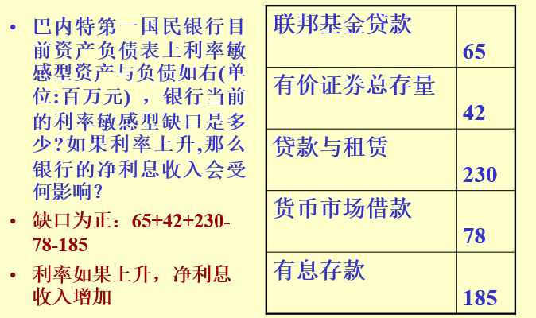

### 商业银行和投资银行差别

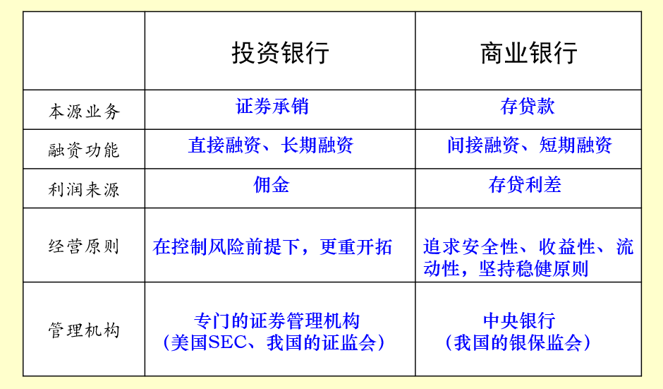

•**合格投资者**：指具备相应风险识别能力和风险承担能力，投资于单只资产管理产品不低于一定金额且符合下列条件的自然人和法人或者其他组织（**2018《**关于规范金融机构资产管理业务的指导意见**》**）：

•**具有2年以上投资经历，且满足以下条件之一：家庭金融净资产不低于300万元，家庭金融资产不低于500万元，或者近3年本人年均收入不低于40万元。**

•**最近1年末净资产不低于1000万元的法人单位。**

•**合格投资者投资于单只固定收益类产品的金额不低于30万元，投资于单只混合类产品的金额不低于40万元，投资于单只权益类产品、单只商品及金融衍生品类产品的金额不低于100万元。**

#### 证券承销

•**代销：证券代销是指证券公司代发行人发售证券，在承销期结束时，将未售出的证券全部退还给发行人的承销方式。**

•**包销：是指证券公司将发行人的证券按照协议全部购入或者在承销期结束时将售后剩余证券全部自行购入的承销方式** 

#### 融资融券

•**融资交易**：投资者以资金或证券作为质押，向证券公司借入资金用于证券买入，并在约定的期限内偿还借款本金和利息。

•**融券交易**：投资者以资金或证券作为质押，向证券公司借入证券卖出，在约定的期限内，买入相同数量和品种的证券归还券商并支付相应的融券费用。

### 资产证券化

**指将公司或金融机构缺乏流动性的资产经过精心的打包、信用增级、流动性增级和结构化后，转化为由这些资产支持的一系列高流动性的证券组合的过程或机制。**

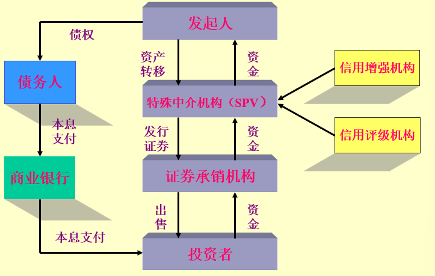

# 金融监管

•**金融监管的主体为了实现监管的目标而利用各种监管手段对监管的对象所采取的一种有意识的和主动的干预和控制活动。**

## 政策调控

•**政策调控是指政府通过**调整**它所掌握的某些经济变量（如财政支出、货币供给等），来**影响**市场经济中各种变量的取值，以影响私人经济部门运动过程。**

•**金融监管则是直接对金融领域的微观经济活动做出某种**限制性规定**，以直接控制微观市场主体的各种经济活动。** 

•**金融监管体制：主要是指金融监管的职责划分、权利分配的方式和组织制度 ，就是监管上的集权和分权的制度安排。** 

•**金融监管体制大体分为三类：集中（统一）监管模式、分业监管模式和综合监管模式。**

#### 集中监管

•**主要优点：**

•**统一监管不仅能节约人力和技术投入**,更重要的是它可以大大地降低信息成本**,** **改善信息质量**, **获得规模效益。**

•**由于所有的监管对象被置于一个监管者的监管之下**, **监管者的责任认定非常明确，避免不同监管机构之间的重复监管、分歧和监管真空。**

•**对于投资者**, **明确的监管机构使他们在其利益受到损害时**, **能便利地进行投诉**, **解决问题**, **降低相关信息的搜寻费用。**

•**主要弊端：**

•**缺乏监管竞争**, **易导致官僚主义。** 

#### 分业管理

•**主要优点**:

•**监管专业化优势，每个监管机构只负责相关监管事务。这种专业化监管分工有利于细分每项监管工作**;

•**监管竞争优势**,每个监管机构之间尽管监管对象不同**,** **但相互之间也存在竞争压力。**

•**主要弊端**:

•**机构庞大**, **监管成本较高；**

•**各监管机构之间协作性差**, **容易出现监管真空带**;

•**如果针对混业经营体制而实行分业监管**, **容易产生重复监管。**

## 必要性

> 功能性金融监管（Functional Regulation）的概念是由哈佛商学院罗伯特·默顿最先提出的，是指基于金融体系基本功能而设计的更具连续性和一致性，并能实施跨产品、跨机构、跨市场协调的监管。
>
> 机构型监管是指按照金融机构的类型设立监管机构，不同的监管机构分别管理各自的金融机构，但某一类型金融机构的监管者无权监管其他类型金融机构的金融活动。

•**金融监管存在理由的经济学解释：金融监管的理论基础。** 

•**一是运用**一般经济监管理论**来解释对金融业监管的必要性，因为金融业是国民经济的重要组成部分。**

•**二是从金融业特殊性出发研究发展起来的**金融脆弱性（不稳定）理论**，也为金融监管的存在性或必要性提供了理论基础。**

•**央行负责宏观审慎监管、银保会**、证监会**负责功能监管、行为监管、机构监管，中国式双峰监管模式雏形初显。**

